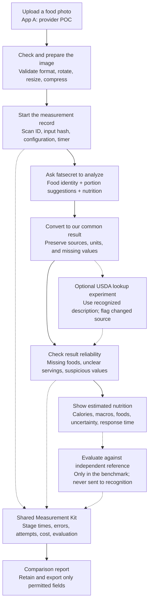
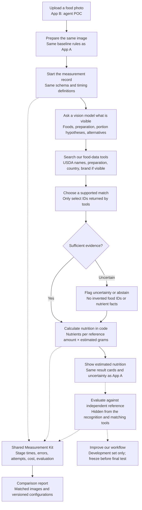

# Food Vision Proof of Concept — Project Plan

**Prepared:** October 1, 2026  
**Purpose:** Build and compare two independently runnable image-to-nutrition applications before selecting the recognition system for our machine.  
**Status:** Proposed implementation plan; no applications, accounts, or GitHub repository have been created by this document.  
**Audience:** Cofounders, technical lead, developer using Claude Code CLI, and food-data evaluator.

## 1. The decision this project should answer

Can our own image-recognition and food-matching workflow deliver sufficiently useful nutrition estimates, at acceptable speed and cost, compared with an integrated food-recognition provider?

Build two applications:

- **App A — Provider POC:** fatsecret image recognition, matching, portions, and nutrition. Add a separately labeled USDA lookup mode where appropriate.
- **App B — Agent POC:** a vision-capable model identifies foods and proposes quantities; our matching tools select USDA records; deterministic code calculates nutrition. Start with one model provider, then add interchangeable OpenAI, Claude, and DeepSeek adapters.
- **Shared Measurement Kit:** the same validation, timing, error classification, confidence presentation, evaluation formulas, and reporting component used by both apps.

Both apps must work independently. Running App A must not require App B or a model API key. Running App B must not require App A or fatsecret credentials. They can share code and a database server, but must have separate entry points and app configuration.

**Recommended implementation:** Python + Streamlit for the two pilot interfaces; FastAPI for reusable backend endpoints; PostgreSQL for structured data; private object storage for permitted images; one private GitHub monorepo.

**Initial interaction:** upload one image, press Analyze, receive estimated calories, protein, carbohydrate, fat, visible food components, portion assumptions, uncertainty indicators, and elapsed time. No scale or machine integration is needed for this phase.

## 2. Facts that constrain the design

### USDA is a data source, not the camera-recognition engine

FoodData Central documents food search and food-detail endpoints, API keys, downloadable datasets, and public-domain/CC0 data. Its API documentation does not offer an image-recognition endpoint. App A therefore gets image recognition from fatsecret, while App B gets it from a vision model. [USDA API guide](https://fdc.nal.usda.gov/api-guide/) · [Downloadable datasets](https://fdc.nal.usda.gov/download-datasets/)

### fatsecret can supply an integrated pipeline

Its v2 image API returns matched foods, suggested portions/weights, and nutrition. It is an optional add-on. The documentation also specifies request-size restrictions, a 999,982-character limit for `image_b64`, and rejection of nutrition-label-only images with error 211. It says the only storable response values are `food_id` and `serving_id`. [Image API](https://platform.fatsecret.com/docs/v2/image.recognition)

**Required action:** confirm image access, allowed regions, authentication requirements, attribution, and rights to retain nutrition results, derived accuracy metrics, exports, and caches. Until clarified, keep restricted results in memory and exclude them from durable logs, snapshots, CI fixtures, exports, and error-report payloads. Ask explicitly about derived metrics; do not assume transforming a response permits storage. Mocked tests and independent reference-data work can proceed meanwhile. [API editions](https://platform.fatsecret.com/api-editions)

### A photo alone cannot establish exact nutrition

Our product design must distinguish observed food identity from assumed ingredients and estimated quantity. Hidden oil, preparation, and portion depth can materially change the result. Image-only outputs are estimates; a well-formatted answer does not establish accuracy.

### Confidence, agreement, and accuracy are separate

- **Confidence:** an estimate of reliability before the true answer is known.
- **Agreement:** whether A and B give similar answers. Two systems can agree and both be wrong.
- **Accuracy against reference:** closeness to independently prepared labels, weighed recipes, or reference food records. This still is not a laboratory assay of the photographed meal.
- **Repeatability:** how much an app changes its answer when given the same image repeatedly.

The app should say **“Reference unavailable”** when no independent reference exists. It must never convert agreement or a model's self-reported score into an accuracy percentage.

## 3. Scope and deliverables

### Included in the first phase

- [ ] App A: upload image, call fatsecret, normalize result, display nutrition and timing.
- [ ] App B: upload image, recognize with a vision model, match USDA foods, estimate quantities, calculate and display nutrition.
- [ ] Common output contract and reusable instrumentation package.
- [ ] Development-only comparison screen and command-line benchmark runner.
- [ ] Independent reference-data workflow and a versioned benchmark manifest.
- [ ] Estimated-confidence indicators at launch; empirical calibration after sufficient evaluation.
- [ ] Provider adapters with configurable model IDs and settings.
- [ ] Failure handling, per-scan spend limits, and protected credentials.
- [ ] GitHub issues, PR workflow, CI, reproducible local commands, and deployment runbook.

### Deferred

Custom model training, machine firmware, scale Bluetooth integration, depth sensing, mobile-store releases, nutrition coaching, meal recommendations, full worldwide branded-food coverage, and a large vector database.

Allow a later optional `known_weight_g` experiment through the API, but the primary benchmark must remain image-only. Ground-truth weight is never passed into the image-only recognition workflow.

### Definition of done

Each app launches independently from a clean checkout, processes approved test images with real credentials, returns the common result schema or a typed failure, and exposes the same timing and confidence fields. A reproducible benchmark compares both on identical inputs, reports reference-based errors and failures separately, and identifies limitations. Cofounders receive a recommendation supported by results rather than a demo alone.

## 4. Architecture at a glance

These diagrams describe proposed systems, not provider internals. In Notion, paste each diagram into a code block, select **Mermaid**, and choose **Preview**. Markdown import may leave diagram blocks as code until the language and preview mode are set.

### App A — provider-powered application



The main App A benchmark is `A_native`. The optional `A_usda_lookup` mode must be reported as a different pipeline. Do not silently replace missing nutrients with values from a generic USDA food or claim that both records describe exactly the same product.

### App B — our recognition and matching workflow



An abstained item is left unresolved. It is not assigned zero nutrients. If any item is unresolved, totals must be marked partial or unavailable.

### Boundaries that make migration possible

| Component | Responsibility | Owner |
|---|---|---|
| UI | Image selection, progress, result display, optional corrections | Our team |
| Image preparation | Decode, orientation, compression, input hash | Shared code |
| Recognition adapter | Convert image into food hypotheses or provider result | fatsecret or model provider |
| Matching adapter | Resolve food descriptions to valid records | Provider in A; our tools in B |
| Portion layer | Identify serving basis and estimate grams | Provider in A; our workflow in B |
| Nutrition calculator | Unit conversion and nutrient summation | Shared code where applicable |
| Measurement Kit | Timing, failures, costs, confidence, evaluation | Shared code |
| Storage policy | Determine what may persist or be exported | Shared code, provider-specific rules |

## 5. Technology and database recommendations

### Recommended stack

| Need | Choice | Why this fits the POC |
|---|---|---|
| Two interfaces | Streamlit | Fast Python-based upload/result interfaces; optional browser camera input |
| Backend | FastAPI | Reusable request contracts and endpoints for later machine integration |
| Schema validation | Pydantic | Typed inputs, model outputs, units, and error states |
| API calls | Official provider SDKs; HTTPX for REST | Provider-specific behavior stays in adapters |
| Structured database | PostgreSQL | Good fit for foods, benchmark samples, runs, metrics, and relational joins |
| Local database | PostgreSQL in Docker Compose | Keep development close to hosted behavior |
| Hosted database | Supabase PostgreSQL | Managed Postgres plus private image storage in one service |
| Images | Local private directory initially; Supabase private Storage for shared pilot | Binary images stay outside relational tables and Git |
| Database migrations | SQLAlchemy + Alembic | Explicit versioned schema changes |
| Retrieval | PostgreSQL full-text search; optionally `pg_trgm` after testing | Transparent matching before introducing embeddings |
| Metrics | Standard-library monotonic timers + structured events | Easy to reuse and verify without an observability platform |
| Data analysis | pandas + NumPy; scipy for intervals if needed | Benchmark summaries and paired comparisons |
| Tests and linting | pytest + Ruff | Meaningful contract, arithmetic, adapter, and integration checks |
| Dependency locking | uv and committed lockfile | Reproducible installs and benchmark environments |
| Packaging | Docker + Compose | Separate app deployments, one shared codebase |
| Collaboration | Private GitHub repo + Issues + PRs + Actions | Reviewable changes and repeatable checks |

These are recommendations, not claims that a particular framework is required. Pin actual dependency versions after checking compatibility during scaffolding; do not build against unrecorded “latest” dependencies. [FastAPI documentation](https://fastapi.tiangolo.com/) · [Streamlit camera input](https://docs.streamlit.io/develop/api-reference/widgets/st.camera_input)

### Why PostgreSQL instead of a vector database

Most early matching errors are about cooking state, serving basis, ambiguous names, or wrong product identity. Start with explicit filters and lexical search so failures are explainable. Only add embeddings if the development set demonstrates synonym or retrieval failures that lexical methods cannot resolve. PostgreSQL can remain the primary database if embeddings are added later.

### Keep three kinds of data separate

1. **Food catalog:** permitted nutrition records, reference amounts, units, and provenance. Import a manageable USDA subset first; retain its version and FDC IDs.
2. **Benchmark reference:** images, weighed ingredients, label references, recipes, annotations, and independent target nutrients. Inference services cannot read hidden test annotations.
3. **Run records:** input identifiers, pipeline configuration, stage times, failures, estimated costs, and permitted outputs. A storage-policy filter applies before every database write or export.

Use one local PostgreSQL server with `food_catalog`, `benchmark`, and `telemetry` schemas. In hosted mode, use separate inference and evaluator credentials. Inference credentials must not have access to hidden benchmark labels. App A receives no model secrets; App B receives no fatsecret secrets.

Private Storage access needs deliberate policies. Supabase documents Storage RLS and service-role bypass behavior; do not expose a privileged key in a browser or confuse bucket privacy with complete application authorization. Our backend must check the authenticated user's project/sample access before reading an image. [Supabase Storage access control](https://supabase.com/docs/guides/storage/security/access-control)

### Proposed tables

| Table | Main fields | Notes |
|---|---|---|
| `food_records` | internal ID, provider, provider ID, name, preparation, brand, region, source version, reference grams | USDA first; licensed sources only where permitted |
| `food_nutrients` | food ID, nutrient ID, normalized unit, amount, missingness | Unique per food/version/nutrient; unknown is null |
| `food_portions` | food ID, portion name, quantity, gram weight | Never assume a cup or piece has a universal weight |
| `images` | image ID, object key, original/processed hashes, dimensions, consent, retention deadline | Paths and identifiers; no binary data in Postgres |
| `samples` | sample ID, image ID, group ID, category, split, reference version | Multiple images of one meal stay in one split |
| `reference_items` | sample ID, verified identity, preparation, edible grams, reference source | Evaluator-only access |
| `reference_nutrients` | sample ID, nutrient, amount/unit, method, quality grade | Labels and recipes are references, not lab assays |
| `configurations` | config ID, pipeline, model, parameters, prompt hash, data version, git commit | Immutable once used in a locked evaluation |
| `runs` | run ID, sample ID, batch ID, config ID, status, timestamps, retry count | One fresh analysis request per run |
| `stage_events` | run ID, span ID, parent ID, stage, duration, status, cache state | No prompt/image/nutrition payloads in logs by default |
| `permitted_results` | run ID, structured result, policy version, expiry | Only fields permitted by source and contract |
| `evaluation_metrics` | run ID, reference version, metric, value, unit | Persist source-derived metrics only if permitted |
| `corrections` | run ID, field, before/after if permitted, reason, author | Keep original automatic output separate |
| `calibration_versions` | version, fitting split, definition of success, bin counts, rates, uncertainty | Prevent using final-test labels to calibrate |

Keep provider raw response persistence **off by default**. For fatsecret, the pending-rights mode allows transient display and transient evaluation; durable output-dependent reports require confirmed permission. Timing metadata must remain payload-free. SQL migrations should include foreign keys, uniqueness constraints, timestamps, deletion behavior, and indexes on sample/config/run IDs.

## 6. Repository and independently runnable apps

Use one private repository, proposed name `food-vision-poc`.

```text
food-vision-poc/
  CLAUDE.md
  README.md
  pyproject.toml
  uv.lock
  .env.example
  .gitignore
  apps/
    provider_ui.py
    agent_ui.py
    compare_ui.py
  src/foodvision/
    api/
      factory.py
      provider_app.py
      agent_app.py
    contracts/
      requests.py
      results.py
      errors.py
    pipelines/
      provider_native.py
      provider_usda.py
      agent_grounded.py
      agent_direct.py
    providers/
      fatsecret_client.py
      usda_client.py
      openai_vision.py
      claude_vision.py
      deepseek_vision.py
      registry.py
    matching/
      retrieval.py
      ranking.py
    nutrition/
      units.py
      calculator.py
    measurement/
      spans.py
      events.py
      costs.py
      confidence.py
      evaluation.py
      storage_policy.py
    data/
      models.py
      repositories.py
      object_store.py
    cli/
      main.py
  prompts/
    recognize-food-v1.md
    choose-food-match-v1.md
  benchmarks/
    manifest.example.jsonl
    protocol.md
    dataset-card.md
  tests/
    unit/
    contracts/
    integration/
    evaluation/
  migrations/
  infra/
    Dockerfile
    compose.yml
  docs/
    project-plan.md
    architecture.md
    decisions/
  .github/
    workflows/ci.yml
    ISSUE_TEMPLATE/
    pull_request_template.md
```

The package paths are a target layout for Claude Code to implement. They do not exist yet. Make one shared backend factory with separately registered pipeline routes/configurations; package the same core library into both deployable services. The comparison UI is an internal utility, not a dependency of either application.

### Target commands after scaffolding

These commands are acceptance requirements for the repository. Claude Code must implement the entry points and flags before they can be run successfully.

```powershell
uv sync --frozen
docker compose -f infra/compose.yml up -d postgres
uv run alembic upgrade head
uv run foodvision doctor --app provider
uv run foodvision doctor --app agent
```

App A, in separate terminals:

```powershell
uv run uvicorn foodvision.api.provider_app:app --host 127.0.0.1 --port 8001
uv run streamlit run apps/provider_ui.py --server.port 8501
```

App B, in separate terminals:

```powershell
uv run uvicorn foodvision.api.agent_app:app --host 127.0.0.1 --port 8002
uv run streamlit run apps/agent_ui.py --server.port 8502
```

Comparison utility:

```powershell
uv run streamlit run apps/compare_ui.py --server.port 8503
```

### Configuration contract

Commit empty placeholders in `.env.example`; keep real keys in ignored local env files or deployment secrets. Environment variable names below are our application settings, not universal SDK settings.

```text
DATABASE_URL=
EVALUATOR_DATABASE_URL=
FATSECRET_CLIENT_ID=
FATSECRET_CLIENT_SECRET=
USDA_API_KEY=
OPENAI_API_KEY=
ANTHROPIC_API_KEY=
DEEPSEEK_API_KEY=
VISION_PROVIDER=anthropic
VISION_MODEL=
PIPELINE_MODE=grounded
REGION=US
LANGUAGE=en
IMAGE_STORAGE_MODE=local
IMAGE_RETENTION_DAYS=30
PERSIST_PROVIDER_OUTPUTS=false
PROVIDER_OUTPUT_POLICY_VERSION=pending
ENABLE_LIVE_API_TESTS=false
MAX_EXTERNAL_ATTEMPTS_PER_SCAN=8
MAX_MODEL_CALLS_PER_SCAN=2
MAX_SCAN_SECONDS=45
```

Set region/language for the actual pilot cohort; US is an explicit initial scope assumption. Confirm available model IDs and features with a real smoke test. Record configured model ID and returned model metadata where available. If only a mutable alias exists, note that limitation and rerun a control set before comparing evaluations separated in time.

## 7. Common request and result contracts

### Request

`POST /v1/analyze` uses multipart upload or a previously authorized image ID. A user may supply region; primary mode needs only image input. The server chooses an allowed pipeline/configuration rather than accepting arbitrary provider URLs.

Required internal fields:

- `scan_id`, `image_id`, original and processed image hashes.
- `pipeline_id`, `configuration_id`, schema version.
- `input_mode`: `image_only` initially.
- Region/language and preprocessing version.
- Optional `known_weight_g`, only enabled in a separately named diagnostic experiment.

### Result

```json
{
  "schema_version": "1.0",
  "scan_id": "generated-id",
  "pipeline_id": "agent_grounded",
  "status": "partial",
  "nutrition_basis": "estimated_visible_portion",
  "items": [
    {
      "name": "cooked white rice",
      "preparation": "cooked",
      "portion_g": 180,
      "portion_method": "image_estimated",
      "food_source": "USDA",
      "food_id": "example-only",
      "nutrients": {
        "energy_kcal": null,
        "protein_g": null,
        "carbohydrate_g": null,
        "fat_g": null
      },
      "uncertainty_reasons": ["portion not measured"]
    }
  ],
  "totals": {
    "energy_kcal": null,
    "protein_g": null,
    "carbohydrate_g": null,
    "fat_g": null
  },
  "confidence": {
    "type": "heuristic_uncalibrated",
    "label": "medium",
    "identity": "medium",
    "portion": "low",
    "nutrition_match": "medium",
    "probability": null,
    "calibration_version": null
  },
  "warnings": ["Example schema only; not a calculated result"],
  "metrics": {
    "server_total_ms": 0,
    "external_attempts": 0,
    "estimated_cost_usd": null
  }
}
```

The example intentionally has no invented nutrient values and no real food ID. Schema validation must reject unsupported enums, negative portions, and non-finite numeric values. Calculation and matching checks must reject unsupported unit conversions and IDs outside tool results.

Support result states `complete`, `partial`, `abstained`, and `failed`. Separate failure codes for invalid image, authentication, quota, timeout, refused model request, empty recognition, invalid schema, no match, and missing portion basis.

**Nutrition rules:** preserve nulls; don't turn missing protein into zero. Store units explicitly. Convert energy kJ to kcal only when the source basis is known. For per-100-g records, calculate `amount × portion_g / 100`. For a record per a 40-g serving, use `amount × portion_g / 40`. Do not treat milliliters as grams without a supported density/portion conversion. Round only at display time.

## 8. Detailed implementation — App A

### A1. Provider access and smoke test

1. Create the fatsecret developer account and request image-recognition access.
2. Validate region, plan, scope, credential handling, and any IP restrictions with that account.
3. Implement OAuth token acquisition and refresh in the backend; reuse an unexpired token with a safety margin rather than refreshing every scan.
4. Make one real request with an owned test image. Confirm response shape and field availability rather than assuming a sample is exhaustive.
5. Record status, elapsed time, endpoint version, and request-size metadata without persisting restricted response content.

Use the current provider authentication specification. [fatsecret OAuth documentation](https://platform.fatsecret.com/docs/guides/authentication/oauth2)

### A2. Image preparation

1. Decode actual bytes and reject unsupported content; file extension alone is insufficient.
2. Apply EXIF orientation, then remove location metadata from the uploaded copy.
3. Preserve aspect ratio and the full plate. Record any resize/compression transform.
4. Use a common baseline copy for both apps, starting with a 512-pixel longest side; benchmark higher resolution separately for B if useful.
5. Compress and validate the actual serialized fatsecret body, including base64 expansion and JSON overhead. Target comfortably below its documented limit; raw image size alone is insufficient.
6. If preparation fails, return a helpful error before any billed call.

### A3. Native analysis

1. Start a scan span and acquire a usable token.
2. Call `POST https://platform.fatsecret.com/rest/image-recognition/v2` with `image_b64`, `include_food_data=true`, and allowed localization parameters.
3. Omit prior-food hints in the baseline benchmark; personalization is a separate experiment.
4. Convert response strings/numbers into our typed schema, preserving source food/serving IDs and preparation where available.
5. Distinguish returned eaten totals from per-serving food facts. Do not scale already scaled totals twice.
6. If servings or nutrition are missing, mark partial or abstain; fetch details only through an explicit, instrumented step.
7. Display result and confidence reasons. Preserve the first automatic result before a user edits it.
8. Apply storage policy before database writes, tracing attachments, downloaded reports, or exception logging.

### A4. Optional USDA lookup mode

Use a returned generic description to search USDA and select a compatible preparation/portion record. Mark `pipeline_id=A_usda_lookup` and retain the changed source. This tests data/matching choices rather than fatsecret alone. It may still rely on restricted provider-derived identity/quantity, so its persistence requires a policy decision. It cannot rescue an empty recognition result because USDA needs a food identity to search.

### A5. Nutrition label and barcode handling

Keep these as separate input categories in evaluation. A nutrition panel alone is not the same as a meal photo; provider-native behavior may reject it. Barcode lookup requires decoding a visible code and provider product coverage. Implement a later barcode adapter only after meal-photo analysis works. Report unsupported inputs rather than secretly invoking a model in App A.

## 9. Detailed implementation — App B

### What “our recognition” means in this phase

We own the prompts, orchestration, retrieval, ranking, calculation, and uncertainty logic. We still buy the underlying model inference. This phase does not train a proprietary vision model.

Use a bounded workflow with tools, not an unrestricted autonomous agent. Recognize once, retrieve candidates, choose among them, calculate in code. No arbitrary web browsing, shell commands, recursive planning, or ground-truth access during inference.

### Provider recommendation

Start with **Claude through its developer API** to reduce the initial number of vendor accounts if the team already uses Anthropic. Add **OpenAI through the Responses API** as the first comparison adapter. Add **DeepSeek** after a capability smoke test. Claude Code is the development tool; it is not the runtime food-recognition API and its CLI session is not the application's serving process.

Both OpenAI and Claude document image input and structured output. Validate every response in our application regardless of provider formatting guarantees; valid JSON does not make food quantities true. Handle refusal, truncation, and schema incompatibility explicitly. [OpenAI vision](https://developers.openai.com/api/docs/guides/images-vision) · [OpenAI structured outputs](https://developers.openai.com/api/docs/guides/structured-outputs) · [Claude vision](https://platform.claude.com/docs/en/build-with-claude/vision) · [Claude structured outputs](https://platform.claude.com/docs/en/build-with-claude/structured-outputs)

DeepSeek's current official vision guide describes `deepseek-flash` image input. The page was indexed during this research, but direct retrieval failed; verify the exact model, supported endpoint, schema/tool behavior, and account access before implementation. Do not assume all DeepSeek models support images or that OpenAI-compatible means identical features. [DeepSeek vision guide](https://api-docs.deepseek.com/guides/vision/)

### B1. Recognition output

Prompt the model to return a structured hypothesis for each visible food:

- Display name and search description.
- Preparation state: raw, cooked, fried, baked, unknown, or another explicitly supported state.
- Visible brand only when evidence is readable.
- Likely portion grams with lower/base/upper scenario assumptions.
- Alternative food identities where uncertain.
- Visible evidence and short uncertainty reasons.
- Whether multiple foods or a composite dish are present.

Do not request hidden chain-of-thought. A short evidence summary is enough. Do not require a confidence percentage; a provider/self-rating may be recorded separately where permitted, but not displayed as calibrated probability.

### B2. Retrieval tools

Implement controlled tools:

- `search_foods(query, preparation, region, limit)`.
- `get_food(food_id)`.
- `get_portions(food_id)`.
- `calculate_nutrition(food_id, grams)` implemented by deterministic code.

Expose only the food catalog to these tools. Start with a downloaded USDA subset covering common pilot foods; add API fallback for gaps with logged data version/retrieval time. Choose a documented data-type precedence for the food category; don't rank branded and generic records as interchangeable.

Retrieve up to five candidates per item. Apply preparation compatibility first, then name/category fit, source quality, and portion support. A record for dry rice cannot win for cooked rice just because its name matches. Handle branded products separately and don't claim exact brand identity from a generic meal image.

### B3. Candidate selection

Use a second model call only when deterministic ranking is ambiguous. Return only an ID from the retrieved candidate list or `no_match`. Validate membership server-side. Recheck unit/portion compatibility after selection. Ask no more than one bounded clarification call within the configured model-call budget.

### B4. Portion and nutrition

Calculate each resolved item's nutrients in code. Record the portion method. If any quantity is unsupported, emit a partial result and identify excluded items. Lower/base/upper scenarios are assumption ranges, not statistical confidence intervals; do not label them as a 95% interval unless separately validated as such.

### B5. Optional direct-model diagnostic

Support `B_direct` inside App B: ask the same vision model for nutrition estimates without food-data tools. Label the result **model-estimated; no database grounding**. This is useful for measuring the value of retrieval, but is not the recommended production path.

Recommended evaluation sequence:

1. `A_native` vs `B_grounded` with one model provider.
2. `B_direct` vs `B_grounded` to measure grounding's value.
3. Repeat B with another provider while keeping data, preprocessing, and budgets fixed.
4. Only then explore `A_usda_lookup`, branded coverage, higher-resolution B input, or measured-weight diagnostics.

## 10. Shared Measurement Kit

Treat measurement as a versioned library, not duplicated code in two pages. Pipelines emit typed events; the evaluator and report builder consume them. It should also work in a future machine service without importing Streamlit.

### Timing definitions

| Metric | Start → stop | Meaning |
|---|---|---|
| `client_total_ms` | Analyze click → result rendered | User-visible wait; measured on the UI side |
| `server_total_ms` | Request received → final result prepared | Full backend analysis time |
| `image_prepare_ms` | Decode → final processed bytes | Input preparation |
| `auth_ms` | Start token operation → usable token | Separate reused-token vs refresh cases |
| `recognition_ms` | Recognition request → usable parsed hypotheses | Includes provider transport and parsing |
| `lookup_ms` | Candidate retrieval start → candidates ready | Food search/detail calls or local search |
| `selection_ms` | Match selection start → validated selection | Includes any model selection call |
| `calculation_ms` | Start arithmetic → result totals ready | Deterministic work |
| `validation_ms` | Start output checks → accepted result | Our contract checks |
| `storage_ms` | Policy-filtered write start → commit | Keep distinct from inference time |
| `evaluation_ms` | Output/reference comparison start → metrics ready | Excluded from inference latency |

Use monotonic clocks such as `perf_counter_ns()` for durations inside a process; UTC timestamps for chronology. Never subtract clocks from different machines to infer a duration. Client timing needs a UI/browser-side span; server timing alone is not click-to-render time.

In Streamlit, implement browser click-to-render timing through a small instrumented custom component or a browser test harness. A Python timer around the HTTP call measures UI-server waiting time, not browser rendering. Until browser timing is implemented, mark `client_total_ms` unavailable and show the correctly labeled backend time.

Capture per-attempt API latency, logical query count, actual attempts, timeout, retry reason, HTTP status class, token usage when supplied, estimated cost, and application-cache state. Don't claim to control a vendor's internal cache. Parallel spans can overlap: report wall time and per-stage values rather than summing overlapping durations.

### Reliability and retry policy

- Suggested initial overall deadline: 45 seconds, adjustable after development measurements.
- Maximum two model calls; one transient retry at most per logical external request.
- Maximum eight external attempts per scan, counting retry attempts, with per-scan cost cap.
- Bound multi-item search concurrency and item count, starting at five candidate food items per scan. Allocate the remaining call budget before retrieving details; retries consume it too. If a scan exceeds limits, return partial/abstained with a reason.
- Retry only supported transient cases such as rate limits or selected transport/server failures; respect `Retry-After` and remaining deadline.
- No automatic retry for bad credentials, unsupported inputs, or invalid food matching.
- A timeout or missing result counts in reliability statistics and cannot disappear from accuracy denominators.

### Reports

For each configuration and food category, show sample count, complete/partial/abstained/failed rates, p50/p95 latency, mean absolute nutrient error, median relative error where appropriate, useful-result pass rate, correction rate, and estimated cost per attempted and per useful scan.

Use the same report definitions in both apps. Do not put performance claims on the standalone UI unless backed by the relevant frozen evaluation.

## 11. Accuracy and confidence protocol

### Dataset design

Start with **30 development smoke-test meals**. Grow to **300 independently referenced meal/product groups** if pilot access and annotation effort allow:

| Category | Target groups | Reference method |
|---|---:|---|
| Single generic foods, including raw/cooked distinctions | 90 | Edible weight + appropriate reference composition |
| Separated mixed plates | 90 | Each component weighed + recipe/ingredient data |
| Composite dishes and hidden ingredients | 60 | Known full recipe, cooked yield, served fraction |
| Branded/packaged and restaurant items | 30 | Exact label/menu version + amount consumed |
| Difficult or unsupported inputs | 30 | Defined expected abstention or reference where possible |

These counts are planning targets. Record actual counts and cohort relevance. Multiple photos of one meal or one product/recipe belong to the same group, not independent samples.

Assign 100 groups to development, 100 to calibration/validation, and 100 to a final locked test, stratified by category where feasible. Keep all variations of a recipe/product family in one split where reuse could leak identity. This is a pilot study, not proof of broad population accuracy; rare category results may remain inconclusive.

### Reference collection

For each sample, retain image rights/consent, region, food identities, preparation, component edible grams, full recipe where known, source records/labels, serving basis, reviewer, and quality grade.

- Grade A: weighed components/recipe and reviewed source values.
- Grade B: exact label/menu data with reliable consumed amount.
- Grade C: reviewer estimate only; suitable for qualitative discussion, excluded from primary numeric accuracy.

Use two reviewers for difficult identities/recipes. Resolve disagreements before scoring. A user correction is useful feedback but not automatically a verified reference.

Reference nutrient totals can use independently selected USDA records, which creates some shared-source dependence with B. Report this limitation. Add exact label/menu and known-recipe subsets, and keep reference selection independent of model choices. Where verified identity and grams exist, score those separately to distinguish recognition/portion errors from nutrient-source agreement.

### Evaluation metrics

For each nutrient with a nonmissing reference:

- Absolute error: `abs(predicted - reference)` in kcal or grams.
- Signed error: `predicted - reference` to detect systematic under/overestimation.
- Relative error: `abs(predicted - reference) / abs(reference)` only when the reference is sufficiently nonzero.
- Report absolute error separately for small/zero nutrient amounts; don't divide by zero or exaggerate a 1-g error on a near-zero target.

Also score food-item precision/recall with a predefined annotation taxonomy, preparation correctness, and per-item portion error when verifiable. Match predicted/reference components through a documented mapping and reviewed ambiguous cases; don't rely on another LLM as the sole truth judge.

**Proposed useful-result event:** a complete result with energy error ≤ `max(50 kcal, 15% of reference)` and each core macro error ≤ `max(3 g, 20% of reference)`. These are initial business thresholds to approve/freeze before final testing, not claims of achieved accuracy or universal nutrition standards.

Report both:

1. Error among scorable returned results.
2. Useful-result pass rate among all attempted samples with complete references, with failures/abstentions counted as nonpasses.

This prevents an app that answers only easy meals from appearing superior without showing coverage. For partial outputs, report item coverage and partial estimates separately, not as whole-meal success.

### Fair comparison procedure

1. Freeze dataset manifest, prompts, data version, config, retry policy, and code commit.
2. Use the same processed image and input context for A and B in the baseline experiment.
3. Disable application-level result caches; mark warm credentials and local catalog conditions explicitly.
4. Run three fresh scans per group/config to measure repeatability. Rotate which pipeline goes first and interleave configurations.
5. Don't count three repeats as three independent meals. Aggregate at meal/group level for confidence intervals and comparisons.
6. Score the first automatic result; measure user-corrected performance separately.
7. Run on the same host/network region with comparable concurrency. Separate load tests from the accuracy experiment.
8. Generate paired comparisons on identical evaluable groups, with category counts and failure differences.
9. Use paired/group bootstrap intervals for metric differences; keep all repeats/photos of a group together when resampling.
10. If the final test informs changes, label those changes a new version and use a new held-out set for the next confirmatory evaluation.

### Confidence presentation

Launch with a **heuristic, uncalibrated** Low/Medium/High badge and explicit reasons across:

- Food identity.
- Portion estimate.
- Nutrition-record match and completeness.

Rules use visible evidence, preparation ambiguity, retrieval candidate ambiguity, missing values, multi-item complexity, and whether quantity was measured. A recognizable food can have high identity confidence and low portion confidence. In image-only mode, portion confidence should remain cautious unless validated evidence supports it.

Don't invent a numerical fatsecret score if its actual response doesn't provide one. Preserve any provider score with its original meaning and label; do not equate it with another model's score.

After freezing the heuristic rules, measure the useful-result event on the calibration set for each confidence bucket. Display an empirical pass rate only when a bucket has enough independent groups, suggested minimum 30, and show its interval/sample count. Otherwise keep “uncalibrated” or “insufficient data.” This modest pilot may not populate every bucket adequately.

For more data later, fit a simple calibration model on validation data, then evaluate calibration on a separate test. Track calibration version, reliability curves, coverage at different confidence thresholds, and false-high-confidence cases. A claim such as “80% likely within tolerance” must refer to a defined event and validated population, not a generic “80% accurate.”

## 12. Step-by-step GitHub and Claude Code workflow

### Step 1 — establish owners and accounts

Assign one person each for product thresholds, technical implementation, reference-data review, and vendor/access/spend. One person may cover multiple roles.

Create or confirm: GitHub organization/repo, Claude Code access, fatsecret image add-on, USDA API key, one runtime vision API account, and Supabase only when shared hosting is needed. Set spending alerts/caps. Confirm how CLI development use and runtime model calls are billed in your accounts.

### Step 2 — install development tools

Install Git, GitHub CLI, Python, uv, Docker Desktop, and Claude Code using their official installation instructions. On Windows, Anthropic documents this native PowerShell installer:

```powershell
irm https://claude.ai/install.ps1 | iex
```

Open a fresh terminal and verify:

```powershell
git --version
gh --version
python --version
uv --version
docker --version
claude --version
claude doctor
gh auth login
```

Run `claude` and complete authentication. Keep runtime API keys separate from repository files. [Claude Code setup](https://code.claude.com/docs/en/setup)

### Step 3 — create the private repository

In the chosen development directory:

```powershell
New-Item -ItemType Directory -Path food-vision-poc
Set-Location -LiteralPath food-vision-poc
git init -b main
```

Copy this plan into `docs/project-plan.md`, create a README and `.gitignore`, and add the CLAUDE.md instructions below. Ignore `.env` variants except `.env.example`, private images, local data, `.venv`, logs, outputs, and credentials. Don't ignore migrations or the dependency lockfile.

After inspecting staged files:

```powershell
git add README.md CLAUDE.md .gitignore docs/project-plan.md
git commit -m "Document food vision POC scope and build plan"
gh repo create food-vision-poc --private --source . --remote origin --push
```

Invite cofounders. Protect `main` with passing CI and review where your GitHub plan supports it; otherwise use the same review convention manually. Enable secret scanning where available. [GitHub protected branches](https://docs.github.com/en/repositories/configuring-branches-and-merges-in-your-repository/managing-protected-branches/about-protected-branches)

### Step 4 — add project instructions for Claude

Create `CLAUDE.md` with the following starter content. Keep it concise and put detailed requirements in referenced project docs. Claude documents CLAUDE.md as project context, not a security enforcement boundary. [Project memory documentation](https://code.claude.com/docs/en/memory)

```markdown
# Food Vision POC

Read docs/project-plan.md before changing architecture or evaluation.
Build two independently runnable apps: provider A and agent B.
Use shared contracts, nutrition arithmetic, telemetry, and evaluation.
Use Python, Streamlit, FastAPI, PostgreSQL, Pydantic, Alembic, and uv.
Implement one GitHub issue per branch. Explain scope before editing.
Treat proposed commands in the plan as entry points to implement.
Check official provider docs before choosing endpoint/model parameters.
Keep model IDs configurable; record prompt, code, data, and config versions.
USDA is a nutrition data source, not an image-recognition provider.
Never invent food IDs, nutrient values, benchmark results, or confidence.
Unknown nutrients stay null. Partial results must be labeled partial.
Use deterministic nutrient arithmetic with explicit units and serving bases.
Never expose API keys or privileged storage/database credentials to UI users.
Do not persist fatsecret output or derived metrics without configured rights.
Apply source-specific storage policy to writes, logs, fixtures, and exports.
The inference service cannot access hidden benchmark labels.
No live paid API tests in normal CI; use explicit opt-in smoke tests.
Log every retry and failure; do not hide unsuccessful benchmark attempts.
Use monotonic clocks for durations and UTC for event timestamps.
Confidence is heuristic until calibrated on separate reference data.
Model self-confidence and A/B agreement are not measured accuracy.
Add meaningful tests for units, contracts, adapters, and metrics.
Run uv run ruff check . and uv run pytest before proposing completion.
Review the diff; state tests run and any unverified provider behavior.
Never claim a stub/mock is a working live integration.
Do not push to main or merge PRs without the team's review workflow.
```

### Step 5 — create milestones and issues

Use labels `app-a`, `app-b`, `shared`, `evaluation`, `data`, `infra`, `vendor`, and `blocked`. Issue fields should include objective, scope, dependencies, acceptance criteria, verification, owner, and documentation changes.

| Issue | Task | Depends on | Acceptance criteria |
|---|---|---|---|
| POC-01 | Access and provider capability checks | None | Real capability smoke test for A and first B model; storage policy recorded |
| POC-02 | Repo scaffolding and CI | None | Locked install; tests/lint on PR; no real API keys required |
| POC-03 | Common contracts and nutrition arithmetic | 02 | Valid schemas; correct serving/unit math; null and partial handling |
| POC-04 | Shared image preparation | 03 | Orientation, format, size, hashes; identical baseline image bytes |
| POC-05 | Measurement Kit v1 | 03 | Stage spans, retry/failure accounting, payload-free persistence policy |
| POC-06 | PostgreSQL migrations and private image storage | 03 | Clean migration; separate evaluator access; retention/deletion checks |
| POC-07 | USDA catalog import and retrieval | 06 | Versioned FDC records; cooked/raw filters; known query fixtures |
| POC-08 | fatsecret adapter and App A | 01,04,05 | Independent image-to-result demo; restricted persistence off |
| POC-09 | First model adapter and App B recognition | 01,03,04,05 | Valid food hypotheses; refusal/invalid-output paths tested |
| POC-10 | B matching tools and grounded calculation | 07,09 | IDs restricted to candidates; no invented nutrients; partial results |
| POC-11 | Shared result UI and confidence reasons | 08,10 | Same fields; Low/Medium/High labeled uncalibrated |
| POC-12 | Reference manifest and 30-meal development set | 06 | Reviewed references; grouped splits; images/labels excluded from inference |
| POC-13 | Benchmark runner and comparison report | 05,08,10,12 | Matched-input runs; failures retained; explicit accuracy denominators |
| POC-14 | Direct-model mode and additional adapters | 09,13 | Separate configurations; provider capability and schema smoke tests |
| POC-15 | Calibration and locked evaluation | 11,13 + sufficient data | Independent calibration/test groups; confidence intervals and sample counts |
| POC-16 | Hosted pilot and cofounder readout | 11,13 | Authenticated apps; reproducible deployment; evidence-based recommendation |

If access blocks 08, continue scaffolding, USDA import, model workflow, and references. Keep A's status visibly blocked; don't replace it with a simulation and call the comparison complete.

### Step 6 — work one issue at a time with Claude Code

Create a branch, run Claude Code in the repo, and give one scoped prompt. Don't paste the whole backlog as a request to “build everything.”

```powershell
git switch -c feat/shared-contracts
claude
```

Use the prompts in section 13. Ask Claude to inspect current code, implement the issue, run checks, and show the diff. Review externally visible behavior yourself. Commit only intended files and open a PR with the problem, resulting behavior, tests, and limitations.

Example after reviewing changes:

```powershell
git add src tests pyproject.toml uv.lock
git commit -m "Add shared analysis contracts and nutrient calculations"
git push -u origin feat/shared-contracts
gh pr create --fill
```

Commands are examples for the named issue; don't blindly stage nonexistent paths or unrelated files. Use a reviewed body file when a richer PR description is needed.

### Step 7 — establish CI

Normal PR checks: locked dependency install; Ruff; pytest; migration against disposable Postgres; contract validation; storage-policy tests. Use synthetic provider fixtures and permitted self-owned images. Do not store live restricted responses as test fixtures.

Live provider smoke tests: manual `workflow_dispatch`, protected environment secrets, tiny approved image set, strict spend limit, and payload-free logs. Never run paid/live credentials on untrusted fork code. Benchmark jobs should be manually launched and versioned rather than silently run on every commit.

Claude's GitHub integration is optional. After ordinary CI is stable, `/install-github-app` can set up the integration. Restrict it to this repo and keep human review for changes. It doesn't replace deterministic tests or a reviewer. [Claude Code GitHub Actions](https://code.claude.com/docs/en/github-actions)

### Step 8 — deploy only after the local comparison works

Build the two API services and two UI entry points from the same locked repo. Deploy as separate services or behind one authenticated reverse proxy. Use Supabase for hosted Postgres/private Storage if selected; keep inference and evaluator privileges separate.

For a small cofounder pilot, an authenticated Docker Compose deployment on one host is sufficient. Don't expose the unauthenticated local POC directly to the public internet. Add request/body limits, project authorization, cost limits, and health checks. Region and provider outbound/IP requirements must be verified before selecting hosting.

Run a smoke test with one known sample in both apps after deployment. Verify that no keys, private image URLs, or provider payloads reach public logs. Record host/region when comparing latency with local results.

## 13. Copy-paste Claude Code implementation prompts

### Prompt 1 — scaffold the project

```text
Read CLAUDE.md and docs/project-plan.md. Implement POC-02 only.
Create the Python package layout, uv-managed dependencies/lockfile,
two independently runnable Streamlit UIs and FastAPI app entry points,
placeholder pipeline interfaces, a mock mode explicitly labeled MOCK,
and PR CI for Ruff and pytest. Add Docker Compose for local Postgres.
Implement the planned doctor CLI skeleton without making paid API calls.
No live credentials, provider responses, or private images in Git.
List the plan first, then implement it, run checks, and summarize the diff.
Document exact local launch commands and any commands not yet implemented.
```

### Prompt 2 — shared contracts, units, and measurement

```text
Implement POC-03 and POC-05 in separate reviewable commits.
Create Pydantic request/result/error contracts and source-aware nutrient
calculations. Test per-100-g and per-serving scaling, kJ conversion,
null nutrients, partial totals, invalid IDs, and no density assumptions.
Create a UI-independent Measurement Kit with monotonic stage spans,
run/config IDs, per-attempt timing, retries, failures, and estimated cost.
Apply a storage-policy filter to every persisted/exported field.
Fatsecret pending-rights mode must not persist outputs or derived scores.
Test policy enforcement and timer behavior with controlled clocks.
Don't implement recognition providers in this issue.
```

### Prompt 3 — USDA catalog and matching

```text
Implement POC-07 using official FoodData Central docs.
Create a versioned importer for a documented subset, retaining FDC IDs,
data types, serving bases, preparation, nutrient units, and source version.
Add lexical/full-text retrieval with preparation/category filters,
top-five candidates, and a typed no-match outcome.
Don't add embeddings yet. Test cooked vs dry rice and raw vs cooked meat.
Keep benchmark labels in an evaluator-only schema inaccessible to tools.
Record any API fallback with its retrieval time/version and rate handling.
```

### Prompt 4 — provider app

```text
Implement POC-08 and its portion of POC-04.
Read the current official fatsecret v2 image and OAuth docs first.
Implement backend auth/token reuse, request-body size validation including
base64 expansion, and provider response normalization.
Handle missing servings, totals vs per-serving facts, empty recognition,
nutrition-label rejection, authorization errors, and instrumented retries.
Use the shared Measurement Kit and result schema. No LLM fallback in A.
Keep restricted responses only in memory unless configured rights allow more.
Provide a real opt-in smoke-test command; don't run it without credentials.
```

### Prompt 5 — agent app

```text
Implement POC-09 and POC-10 with one configured vision provider.
Verify its current official image-input and structured-output docs first.
Recognize visible foods into typed hypotheses, retrieve USDA candidates,
select only candidate IDs, and calculate all grounded nutrients in code.
Use at most two model calls and enforce the planned attempt/deadline budgets.
Do not expose shell/web browsing or hidden benchmark labels to the agent.
Show short evidence summaries, portion assumptions, uncertainty, and abstention.
Model self-confidence is not measured accuracy. Test refusals, truncation,
invalid schema, invented IDs, wrong preparation, and missing portions.
```

### Prompt 6 — benchmarking and confidence

```text
Implement POC-13 using the frozen formulas in docs/project-plan.md.
Create a manifest-driven runner for identical image/context inputs,
three repeats, rotating pipeline order, and configurable concurrency.
Separate development/calibration/held-out groups and record config/prompt/
data/code versions. Score the first automatic result against evaluator-only
references, including failure and abstention denominators.
Report paired nutrient errors, preparation/portion errors, p50/p95 times,
repeatability, cost, and useful-result pass rate by category.
Keep agreement distinct from accuracy; no fabricated confidence percentages.
Honor source-specific persistence/export rights, including derived metrics.
Test with synthetic known predictions before running real providers.
```

### Prompt 7 — review before pilot release

```text
Review the implementation against the plan without expanding scope.
Verify each app starts independently and needs only its own provider secrets.
Look for unit/serving errors, ground-truth leakage, missing failure records,
restricted response persistence, confidence mislabeling, and exposed secrets.
Run documented CI checks and both mock integration flows.
List live-provider behavior still unverified; don't claim those checks passed.
Produce a deployment checklist and a PR-ready summary of any fixes.
```

## 14. Benchmark commands Claude Code should implement

```powershell
uv run foodvision import-usda --dataset <local-dataset-path> --version <source-version>
uv run foodvision validate-manifest --manifest benchmarks/pilot-v1.jsonl
uv run foodvision benchmark --manifest benchmarks/pilot-v1.jsonl --split development --configs A_native,B_grounded --repeats 3 --concurrency 1 --output work/eval-dev
uv run foodvision report --batch <batch-id> --output work/report-dev
uv run foodvision calibrate --manifest benchmarks/pilot-v1.jsonl --split calibration --config B_grounded
uv run foodvision benchmark --manifest benchmarks/pilot-v1.jsonl --split test --configs A_native,B_grounded --repeats 3 --concurrency 1 --output work/eval-test
```

Replace angle-bracket placeholders; don't execute them literally. The runner must enforce the requested split, permission-aware exports, deadlines, and spend cap. Where fatsecret-derived persistence is not authorized, run transient comparisons and state that durable A metrics are unavailable; do not write a misleading empty-success report.

## 15. Proposed schedule and decision gates

**Planning estimate:** approximately 20–30 focused engineering days plus vendor access and reference-data collection. Calendar duration depends on team availability; a four-to-six-week pilot is plausible if access and annotation progress together. This is not a delivery guarantee.

| Phase | Approximate effort | Main work | Exit gate |
|---|---:|---|---|
| Access and foundations | 3–5 engineering days | Credentials, contracts, repo, CI, storage rules, initial references | Provider capabilities known; shared contract approved |
| Two functional apps | 7–10 days | A adapter, B recognition/matching, shared UI and measurement | Both independently analyze a real image |
| Evaluation and iteration | 5–8 days | Reviewed reference set, runner, development evaluation, fixes | Comparable metrics; data/prompt/config frozen |
| Locked test and pilot release | 3–5 days | Held-out evaluation, confidence evidence, deploy, readout | Reproducible report and explicit go/no-go |

### Provisional decision criteria

Approve thresholds before locked evaluation. Suggested starting targets:

- ≥95% valid inputs produce a typed result or a clear abstention within deadline.
- No hidden exclusions of failures and no unmarked partial nutrition totals.
- p95 server analysis time ≤15 seconds for intended pilot categories; record misses and reassess with observed data.
- App B's useful-result rate no more than 5 percentage points below A on the locked paired test, with uncertainty intervals shown.
- A lower cost or better performance must be material enough to justify owning B's maintenance.
- Confidence displays are correctly labeled and false-high-confidence cases reviewed.

These are proposed business gates. A small locked test may be unable to establish the 5-point comparison conclusively. “Inconclusive; collect more data” is a valid decision. Evaluate calorie and each macro separately; don't compress everything into one misleading accuracy number.

## 16. Budget, risks, and controls

### Cost model

For each configuration:

`experiment cost = referenced groups × repeats × average cost per attempted scan + retries/detail calls + hosting/storage`

Example workload: 300 groups × 3 repeats × 2 configurations = **1,800 attempted scans**. Adding two more B configurations doubles this to **3,600**. Calls per scan may differ materially because B includes retrieval/selection and A may need detail calls. Benchmark one B provider first, then expand only if results justify it.

After 30 smoke-test meals, estimate cost from observed usage and current account pricing, then set a pilot cap. Record CLI development spend separately from runtime inference, catalog imports, and hosted infrastructure. Provider quotes and account pricing must be checked before committing a numerical budget; this plan does not assume an API tier is free or universally available.

### Material risks

| Risk | Impact | Response |
|---|---|---|
| fatsecret permissions don't support stored comparison results | A evaluation/report persistence limited | Clarify early; transient display/evaluation and allowed metadata until agreement |
| Photo portions are inaccurate | Recognition looks right but calories are wrong | Score portions separately; offer measured-weight diagnostic later |
| Shared USDA source inflates apparent B performance | Source agreement mistaken for independent accuracy | Independent record selection, label/recipe subsets, identity/grams scoring |
| Model/provider changes during study | Results cease to be comparable | Pin versions where possible; record aliases; control-set reruns |
| Benchmark examples leak into prompts/tools | Held-out results optimistic | Separate evaluator credentials; grouped splits; inference input audit |
| Nutrition arithmetic double-scales servings | Systematic wrong totals | Unit/per-serving tests and source-basis checks |
| Agent produces convincing unsupported facts | False precision and high-confidence errors | Candidate-ID validation, database grounding, partial/abstain states |
| Repeated calls or retries hide cost/latency | Misleading provider comparison | Per-attempt telemetry and end-to-end deadlines |
| Poor pilot-country product coverage | Frequent generic substitutions | Explicit region scope and category-based reporting |

Retention default is a proposed 30 days for pilot images unless participant consent or study needs justify another documented period. Benchmark images may need a different consented retention period for reproducibility. Keep images private, strip location metadata, and make deletion propagate to storage/references as appropriate without silently altering locked benchmark manifests. Publish only owned/consented samples and permitted output fields.

## 17. Cofounder readout and next architecture decision

Deliver a short report answering:

1. Which workflow returns the most useful complete estimates for our intended foods?
2. Which errors come from recognition, portions, preparation, retrieval, or nutrient coverage?
3. What are the paired calorie/macro errors, p50/p95 latency, failure rates, and costs?
4. Do confidence indicators identify risky outputs, and where are they uncalibrated?
5. What changes if measured weight is supplied in a separate experiment?
6. Is the evidence sufficient to keep fatsecret, adopt B for selected categories, or collect more data?

Carry the shared API/result schema and Measurement Kit into the machine pilot. If B wins for some categories, route those categories gradually while retaining a provider fallback in the future product. The standalone benchmark apps should keep pure labeled modes so hybrid routing doesn't obscure the comparison.

## 18. Source and evidence ledger

Accessed/reviewed October 1, 2026. Implementation details and thresholds above are recommendations unless explicitly attributed. Most documentation is mutable and has no clear publication date; recheck before integration.

| Claim | Evidence type / confidence | Source / caveat |
|---|---|---|
| fatsecret v2 analyzes food images, has payload limits, and restricts stored response fields | Official documentation / high | [Image recognition](https://platform.fatsecret.com/docs/v2/image.recognition); account permissions/contract still unverified |
| Image recognition is an add-on and access varies by edition | Official documentation / high | [Editions](https://platform.fatsecret.com/api-editions); obtain current quote |
| USDA provides nutrition lookup/downloads and CC0 data | Official documentation / high | [API guide](https://fdc.nal.usda.gov/api-guide/); no documented vision endpoint |
| OpenAI supports image input and structured response formats | Official documentation / high | [Vision](https://developers.openai.com/api/docs/guides/images-vision), [structured outputs](https://developers.openai.com/api/docs/guides/structured-outputs); select supported model |
| Claude supports image input and structured output | Official documentation / high | [Vision](https://platform.claude.com/docs/en/build-with-claude/vision), [structured outputs](https://platform.claude.com/docs/en/build-with-claude/structured-outputs); confirm model/API support |
| DeepSeek has a documented vision-capable Flash offering | Official indexed documentation / medium | [Vision](https://api-docs.deepseek.com/guides/vision/); direct retrieval failed; live capability probe required |
| CLAUDE.md supports shared project instructions; GitHub integration available | Official documentation / high | [Memory](https://code.claude.com/docs/en/memory), [GitHub Actions](https://code.claude.com/docs/en/github-actions) |
| Supabase Storage supports access policies and privileged-key bypass | Official documentation / high | [Storage control](https://supabase.com/docs/guides/storage/security/access-control); application authorization still required |
| Markdown can be imported to Notion | Official documentation / high | [Notion import](https://www.notion.com/help/import-data-into-notion); Mermaid preview may require manual block setup |

## 19. Put this plan into Notion

Import this `.md` file using Notion's Import option for Text & Markdown. Check tables, checklists, and code blocks after import. Set the two flowchart blocks to Mermaid/Preview manually if they arrive as plain code.

Suggested Notion page structure: use this page as the master plan; add linked child pages for the decision log, vendor permissions, benchmark dataset card, and weekly readout. Use GitHub Issues as the implementation source of truth and link them from Notion; avoid maintaining two separate task backlogs.

**First action:** open POC-01 and POC-02, verify provider access/retention terms, and ask Claude Code to scaffold the shared architecture. In parallel within the team, begin the first 30 independently referenced meals.
